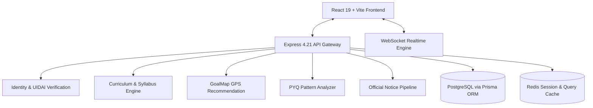

# BEU Connect Hub - System Architecture Blueprint

## Overview
BEU Connect Hub is a unified, real-time academic collaboration platform engineered specifically for students, faculty, and alumni of Bihar Engineering University (BEU), Patna.

## Core Architectural Pillars
1. **Academic Integrity & Localization**: Strict adherence to the official BEU 5-tier curriculum structure covering all 34 engineering branches and 8 semesters.
2. **UIDAI-Compliant Student Verification**: Privacy-first identity onboarding with hashed Aadhaar checksums and registration number matching.
3. **Decentralized Resource Sharing**: High-availability notes and PYQ distribution with SHA-256 integrity verification.
4. **Adaptive Career GPS**: Heuristic career roadmap engine mapping semester syllabus topics to industry-ready skills.
